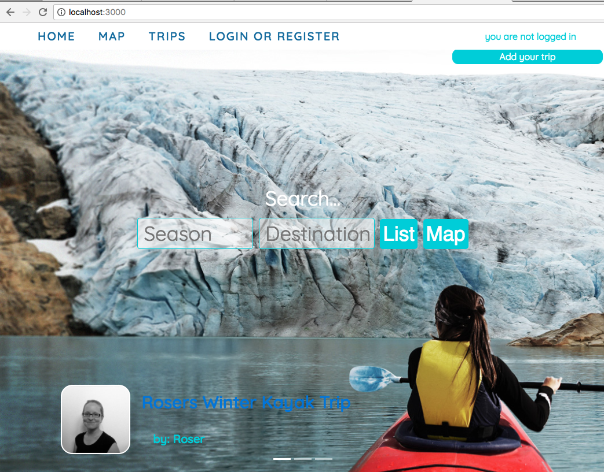
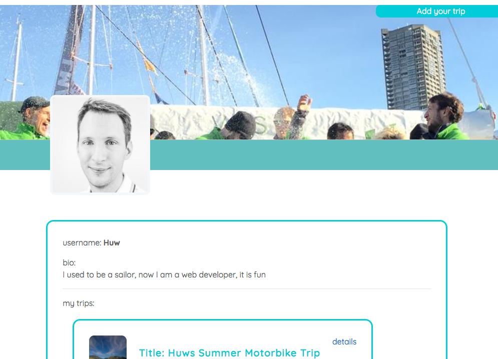
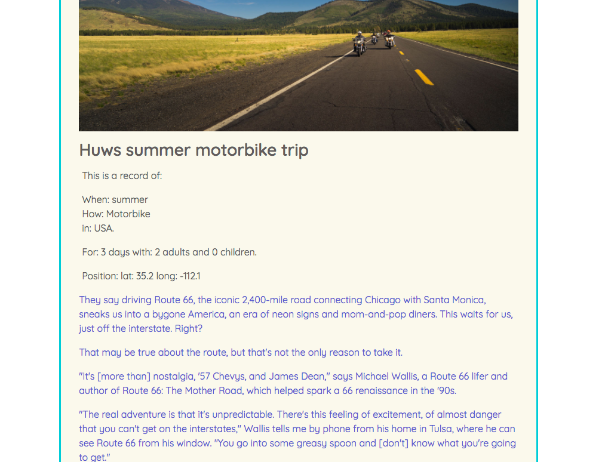

### This is a searchable blogging site, it needs a MongoDB database to work

If you want to continue to work on this project:

* clone the repo from GitHub.
* navigate to the directory in your terminal and run: `$ npm install`.
* You'll need MongoDB installed, then run: `$ mongod` from another tab in the terminal.
* Back in the first terminal tab, after the Node packages have been installed:
* populate the database by running: `$ node db/seeds`.
* then run: `$ gulp`

If that all works then you should be able to:

Open browser and navigate to `http//:localhost:3000`

# Blogging site:

###GA WDI London - Project 2

I never came up with a name for this website! The idea was for it to host many different adventure and travel blogs, and to be easily searchable, partly because it is nice to read other blogs, but also to provide inspiration and education for would be adventurers.

#### Approach / How it works

Users create accounts that have facebook/twitter style profile pages. Once they are registered they can add their own travel diaries/blogs. If you do not register you can still search and view blogs and profile pages.

When you write a blog you can ad some formatting in markdown as you go. Blogs are editable and deletable. Each blog has a hero image at it's head, and a gallery of other images. There are details at the start of each blog that are used to filter the search results such as season and location.

#### The build

* HTML 5, SCSS, Bootstrap are served with Node.js and a MongoDB.
* The desktop version was styled with reference to Airbnb and instructables.
* The mobile view was an extension on this theme.
* AWS was used for image storage.
* Google Maps is used to plot each blog.

#### Problems & Challenges

The two biggest problems with this project were that the scope was too big, and that the search function was too complicated for the time available.

1. With the scope being too large, it is only at MVP and so far only the homepage is responsive for mobile, which is a shame.
2. The search function relies on query strings being sent to the server, it works well, but so far I have only been able to include two search terms - season and location - there is no autocomplete or filtering so that it is easy to return zero results.
